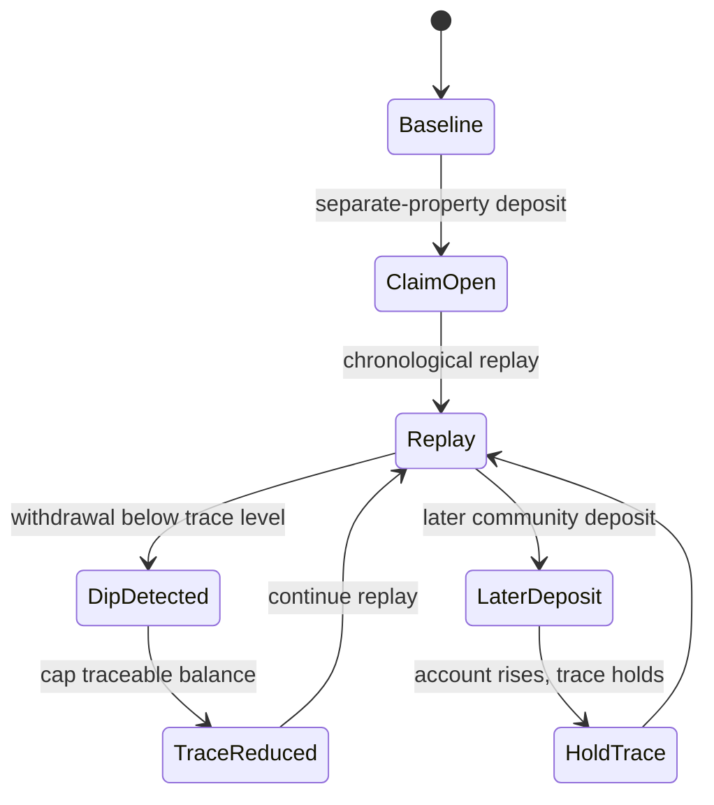

# LIBR State Machine Demo

[](https://github.com/Vinaygond/libr-state-machine-demo/actions/workflows/test.yml)
[](LICENSE)
[](https://www.python.org/)
[](#quickstart)

A dependency-free Python reference implementation of the **Lowest Intermediate
Balance Rule (LIBR)**, modeled as a deterministic ledger state machine.

Public companion artifact for [Exit Protocol](https://exitprotocols.com/) ·
[Engineering note](https://exitprotocols.com/engineering/libr-state-machine/) ·
[LIBR guide](https://exitprotocols.com/libr/) ·
[Sample workpaper](https://exitprotocols.com/sample-report/)

## Why reviewers trust this artifact

| Signal | What it means |
|---|---|
| **Zero dependencies** | No hidden packages; the full calculator is in `libr.py` |
| **Regression tests** | Core edge cases encoded as `unittest` coverage |
| **Golden CLI outputs** | `examples/expected/*.json` for reproducible machine checks |
| **CI on 3.10–3.12** | Same tests run on every push |
| **Synthetic fixtures only** | No customer data, no private workflows |
| **Explicit boundaries** | See [DISCLAIMER.md](DISCLAIMER.md) and [VALIDATION.md](VALIDATION.md) |

This repository is intentionally narrow. It demonstrates one calculation model
for technical inspection — not the full Exit Protocol application.

## State transition

```text
provisional_traceable = traceable_before + new_separate_deposit
traceable_after = min(provisional_traceable, max(account_balance_after, 0))
```

Later community deposits may raise the account balance, but they do not
automatically restore a separate-property claim after a dip has reduced it.



## Expected outputs

| Fixture | Ordering | Final balance | Traceable remainder | Notes |
|---|---|---:|---:|---|
| `examples/minimal_dip_ledger.csv` | `ledger` | `$65,000.00` | `$45,000.00` | Dip-and-hold story from the engineering page |
| `examples/synthetic_ledger.csv` | `ledger` | `$16,635.38` | `$0.00` | Exhaustion on `2026-02-07` COINBASE row |
| `examples/minimal_dip_ledger.csv` | `worst_case` | same as ledger | may differ on same-day rows | Shows ordering sensitivity |

Verify locally:

```bash
python -m unittest discover -s tests -v
python libr.py examples/minimal_dip_ledger.csv
python libr.py examples/synthetic_ledger.csv
python libr.py examples/minimal_dip_ledger.csv --json
```

## Scope boundary

- **V1 single-claim replay only**
- **Multi-claim pro-rata allocation** is out of scope here
- **Not legal advice**, not expert testimony, not a court-filing or admissibility claim
- **Synthetic fixtures only**

## Repository structure

```text
libr.py                              Calculator + CLI (single source of truth)
examples/minimal_dip_ledger.csv      Small dip-and-hold fixture
examples/synthetic_ledger.csv        Longer synthetic commingled ledger
examples/expected/*.json             Golden CLI outputs for reproducibility
tests/test_libr.py                   Behavioral regression tests
tests/test_golden_fixtures.py        Golden-output regression tests
VALIDATION.md                        Reviewer matrix and invariants
DISCLAIMER.md                        Professional boundary statement
CHANGELOG.md                         Public artifact version history
CITATION.cff                         Citation metadata for diligence / research
.github/workflows/test.yml           CI runner
LICENSE                              MIT
```

## Quickstart

Requires Python 3.10+.

```bash
git clone https://github.com/Vinaygond/libr-state-machine-demo.git
cd libr-state-machine-demo
python -m unittest discover -s tests -v
python libr.py examples/minimal_dip_ledger.csv
python libr.py examples/synthetic_ledger.csv --ordering worst_case
python libr.py --version examples/minimal_dip_ledger.csv
```

## CSV format

```csv
date,description,amount,separate_deposit
2023-02-08,INITIAL SEPARATE PROPERTY DEPOSIT,250000.00,250000.00
2023-02-10,POS DEBIT: DoorDash,-106.72,0.00
```

| Column | Meaning |
|---|---|
| `date` | ISO date `YYYY-MM-DD` |
| `description` | Transaction description |
| `amount` | Positive deposit, negative withdrawal |
| `separate_deposit` | Separate-property funds introduced on this row |

## Same-day ambiguity

| Demo mode | Meaning | Exit Protocol alias |
|---|---|---|
| `ledger` | Preserve CSV order within each date | neutral |
| `worst_case` | Withdrawals before deposits on same day | minimize |
| `best_case` | Deposits before withdrawals on same day | maximize |

This exposes calculation range; it does not resolve legal timestamp uncertainty.

## Diligence workflow

1. Read [VALIDATION.md](VALIDATION.md) for the invariant matrix.
2. Run the test suite and inspect golden outputs.
3. Replay `minimal_dip_ledger.csv` to see non-replenishment after a dip.
4. Replay `synthetic_ledger.csv` to see long-horizon exhaustion behavior.
5. Compare Exit Protocol's public engineering note and sample workpaper for product context.

## Contributing feedback

Use [Edge case feedback](.github/ISSUE_TEMPLATE/edge_case_feedback.yml) for:

- same-day ordering ambiguity
- overdraft rows
- multiple separate-property deposits
- better ways to present calculation traces for human review

## Citation

If you reference this artifact in diligence or research materials, see [CITATION.cff](CITATION.cff).

## License

MIT — see [LICENSE](LICENSE).
